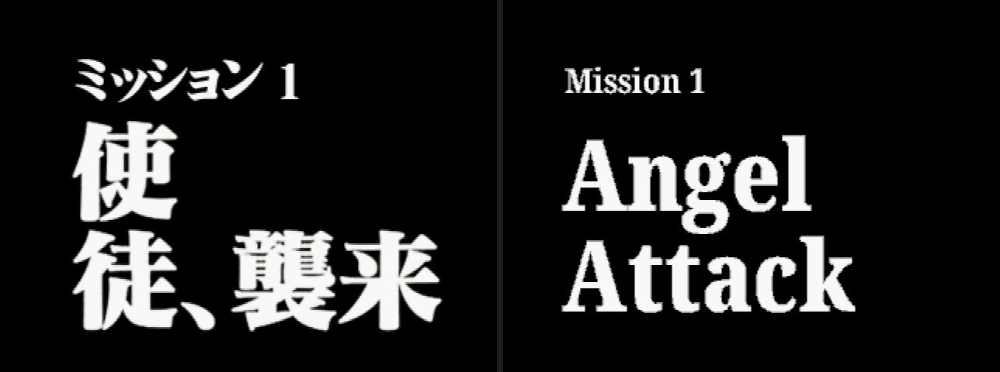
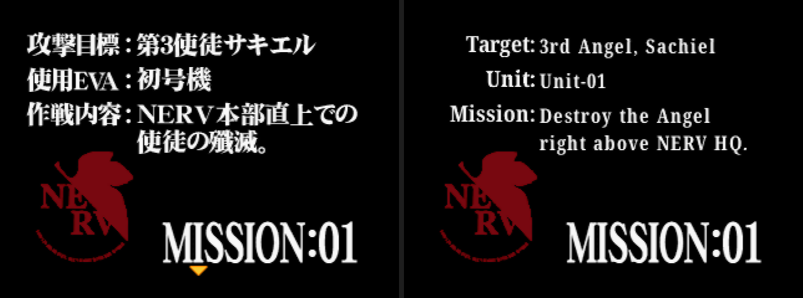
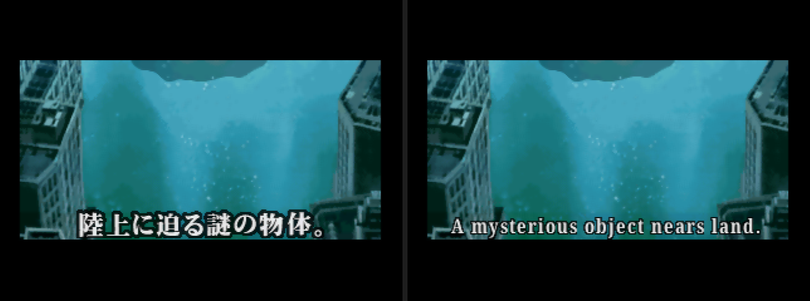
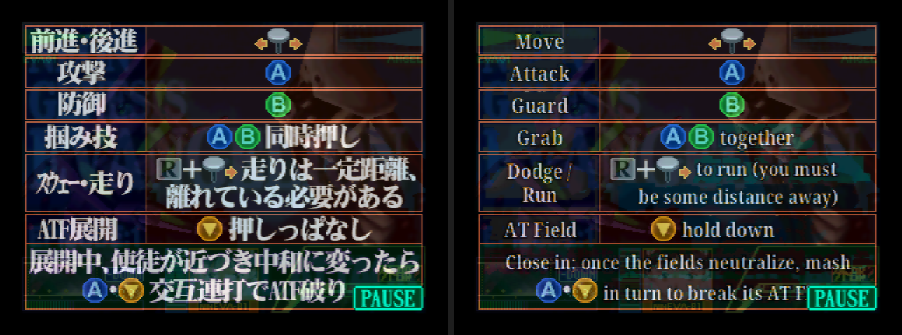
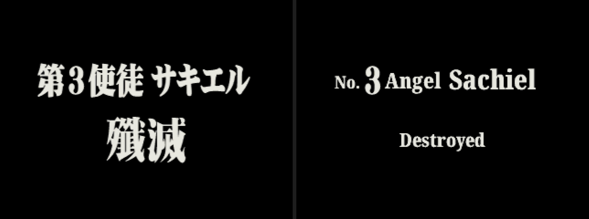
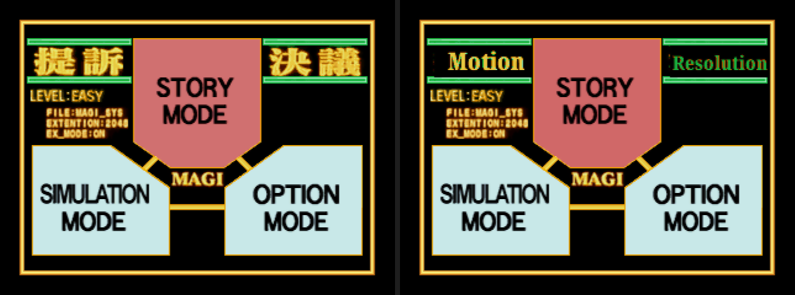

# Neon Genesis Evangelion (Nintendo 64) – English translation

An unofficial fan translation of Bandai's 1999 Nintendo 64 game *Neon Genesis Evangelion* (Japan only).
Version 0.5 (beta).

**Download:** [`games/eva64/patch/eva64_english_v0.5.xdelta`](games/eva64/patch/eva64_english_v0.5.xdelta)
**Read first:** [`games/eva64/patch/README.txt`](games/eva64/patch/README.txt) – which ROM you need, how to apply the patch, emulator notes and known issues.

The patch contains no game data. You need your own copy of the Japanese ROM (No-Intro
"Neon Genesis Evangelion (Japan)", SHA-1 `A9BA0A4AFEED48080F54AA237850F3676B3D9980`).

## Screenshots

Japanese original on the left, English patch on the right (captured at the same frame on an emulator).








More pairs in [`screenshots/`](screenshots/), and all of them on one sheet: [`screenshots/all_pairs.png`](screenshots/all_pairs.png).
Single English frames at the game's native 320x240 are in [`screenshots/english/`](screenshots/english/).

## What is translated

- All subtitles, narration and mission briefings for missions 1 to 13.
- Mission title cards, "Angel destroyed" cards and story cards.
- Pause-screen control guides for every mission.
- Main menu, erase-data screen, the mission 5 practice/battle choice, simulation mode, model viewer.
- Opening company credits and copyright lines.

Left in Japanese: the staff names in the end credits, the title logo, a few small battle-display
labels and three pictures with artwork behind the text. Voices are Japanese (most spoken lines
have no subtitles in the original game).

## Status

Beta. Every screen has been checked by jumping to scenes with a scripted emulator and the
opening missions have been played by hand, but nobody has finished the game on the patch yet.
Please report crashes, garbled text and anything still in Japanese.

Tested on Project64 3.0.1, ares v148, BizHawk 2.11.1 and M64Plus FZ (Android). The patched ROM
keeps the original header checksum and tolerates the smaller save chip that unrecognised ROMs
are given, so it should run without emulator settings changes.

## How it was made

The text was translated from the Japanese by an AI model (Anthropic's Claude), which also wrote
the tools in this repository, working with and directed by PromptPirate, who approved the glossary
and style and tested builds. It has not been checked by a professional translator. See
`games/eva64/GAME.md` for the full technical notes and session log.

## Repository layout

```
games/eva64/patch/     the patch and its readme
games/eva64/scripts/   the English script (strings_en.tsv), image text (images_en.tsv,
                       screens_en.tsv), character tables and the credit emblem
games/eva64/GAME.md    technical notes: formats, addresses, decisions, progress log
tools/eva64/           Python tools: extract, build, verify, font/image makers, test harness
tools/fonts/           Noto Serif and Noto Emoji (SIL Open Font License)
docs/                  the workspace's general workflow, pitfalls and style guide
```

The tools expect the ROM at `games/eva64/original/*.z64` (not included) and write to
`games/eva64/work/` (ignored). Each `.bat` creates its own Python 3.11 virtual environment.
Rebuilding the patch: `tools\eva64\makepatch.bat <version>`.

## Credits

- Translation, tools and testing: PromptPirate (promptpirate-x), with Claude (Anthropic).
- The Korean translation of this game (romhacking.net translation 6260) was used as a reference
  for where the text and text images are.
- The [Evangelion 64 decompilation project](https://github.com/farisawan-2000/evangelion) and its
  contributors' notes (farisawan-2000, IlDucci, Zoinkity, Dark_Kudoh, GriffithVIII) were used as a
  reference for the game's layout. No code or data from it is included.
- Fonts: Noto Serif and Noto Emoji, © The Noto Project Authors, SIL Open Font License 1.1.
- Tools used: xdelta3, BizHawk, ares, capstone, Pillow, z3.

*Neon Genesis Evangelion* is © GAINAX / Project Eva., TV Tokyo and its other rights holders; the
game is © 1999 BANDAI. This project is not affiliated with or endorsed by them. Do not sell the
patch, and do not distribute it together with the game.

## Licence

The tools, scripts and documentation are under the MIT License (see `LICENSE`). The translated
text and redrawn images are a free fan translation of copyrighted material and are not covered by
it; the fonts are under the SIL Open Font License.
